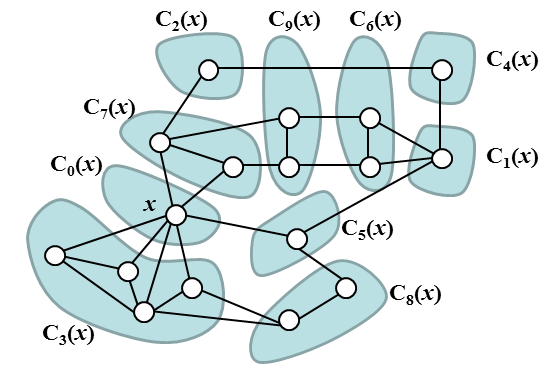
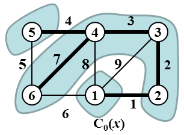

# Minimum Cascading Spanning Tree

In the following definitions we suppose that G = (V, E) is an unempty undirected connected graph. V is the set of its vertices and E is the set of its edges. Let v, w be two vertices of G. We define the **distance between v and w** as the length of the shortest path between v and w and denote it by the symbol dist(v, w). (The length of a path is equal to the number of edges in the path.) For a nonnegative integer r we denote by symbol D(v, r) the set of all such vertices of V which distance from v is equal to r.

Let H be a subgraph of G and let W be the set of all vertices of H. We say that H is **induced by set W** if, for any pair of vertices v, w ∈ W, {v, w} is an edge of H if and only if {v, w} is an edge of G. We denote by symbol INDU(G,W) the subgraph of G induced by set W. Note that graph INDU(G,W) is defined unambiguously.

Let x be a vertex of G. We say that two vertices v, w ∈ V are **x-distance binded** if dist(x, v) = dist(x, w) and moreover v and w belong to the same connected component of the graph INDU(G, D(x, dist(x, v))).

The relation "vertices v and w are x-distance binded" is an equivalence relation on V and it thus defines decompositon of V into equivalence classes. Let us denote these classes by symbols C0(x), C1(x), C2(x), ..., Cp(x), p > 0. We reserve symbol C0(x) for the set {x} which itself is an equivalence class in this relation. Note that except for the set C0(x) the index j of the set Cj(x) is not related to the distance of the vertices of Cj(x) from vertex x.



***Image 1.** The image shows an example of graph with denoted vertex x, and decomposition of the set of its vertices into classes C0(x), C1(x), C2(x), ... C9(x). The set of vertices of induced subgraph INDU(G, D(x, 1)) is the union of classes C3(x), C5(x), and C7(x). The set of vertices of induced subgraph INDU(G, D(x, 2)) is the union of classes C1(x), C2(x), C8(x), and C9(x). The set of vertices of induced subgraph INDU(G, D(x, 3)) is the union of classes C4(x) and C6(x).*

Let T be a spanning tree of G, let x be a vertex of G and let C0(x), C1(x), C2(x), ... Cp(x) be the decompositon of V into classes defined by relation "vertices v and w are x-distance binded". We say that T **respects decomposition of V into classes C0(x), C1(x), C2(x), ..., Cp(x)** if for each j = 1, 2, ..., p holds that T contains exactly one edge {vj, wj} ∈ E(T) such that (vj ∈ Cj(x)) and (wj ∉ Cj(x)) and (dist(x, vj) = dist(x, wj) + 1).

Let W be a set of vertices of G and let T be a spanning tree of G. We say that **T simply spans W** if the graph INDU(T, W) is connected.

We say that spanning tree T of G is **cascading** if there exists vertex x ∈ V such that T respects decomposition of G into classes C0(x), C1(x), C2(x), ..., Cp(x) and T simply spans each class Cj(x), j = 0, 1, 2, ..., p. We say that x defined in the previous sentence is **cascading center of T**. We say that a spanning tree T of G is **minimum cascading** if T is cascading and its weight is minimal among all cascading spanning trees of G.

## The task
We are given an undirected integer-weighted graph G = (V, E, φ), φ: E → ℤ. We have to find the weight of minimum cascading spanning tree of G. The weight of a tree is a sum of weights of all its edges.

### Input
The first line of input contains two positive integers N, M separated by space. N represents the order of the graph (number of vertices) and M represents the size of the graph (number of edges). We suppose that graph vertices are labeled 1, 2, 3, ..., N. Next, there are M lines of input, each line specifies one edge. The edge specification consists of three integer values separated by spaces. The first two values represent the labels of the end vertices of the edge, the third value represents the weight of the edge. Note that edge weights might be negative. The edges and its end vertices are given in no specific order.

It holds, 2 ≤ N ≤ 500, N−1 ≤ M ≤ 10000. The absolute value of any edge weight does not exceed 10.

### Output
The output contains a single text line with integer representing the weight of minimum cascading spanning tree of the input graph.

### Example 1
#### Input
```
6 9
1 2 1
1 3 9
1 4 8
1 6 6
2 3 2
3 4 3
4 5 4
4 6 7
5 6 5
```
#### Output
```
17
```



***Image 2.** The input graph and the solution of Example 1, the cascading center of the minimum cascading spanning tree is vertex 1. Vertex equivalence classes are highlighted.*

### Example2
#### Input
```
5 6
1 2 10
1 3 1
2 4 5
3 4 10
3 5 1
4 5 5
```
#### Output
```
12
```

The public data set is intended for easier debugging and approximate program correctness checking. The public data set is stored also in the upload system and each time a student submits a solution it is run on the public dataset and the program output to stdout a stderr is available to him/her.