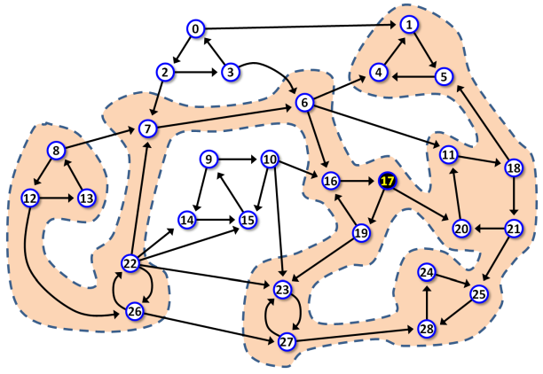

# Survival Kits at the Peaks
All tracks in Patagonian Peaks National Park are considered to be one-way tracks, due to the extremely difficult terrain. Scarce easier tracks which can be traversed in both directions are considered to be two separate tracks in oposite directions.

There are many points of interest, often called only points, in the park. Each track connects some pair of points. No two tracks intersect or split outside a point.

The one-way character of the tracks forced the Park management to divide the park into separate so-called areas. Each area has the following property: When in an area, a hiker my travel, following the tracks, between any two points in the area, without leaving the area. Also, if any other point in the park is added to the area, this given property would be lost, it would not be possible to travel between any two points in the area.
In extreme case, an area may consist of only one point and no tracks at all.

Each hiker in the park has to travel in a group with at least one licensed mountain guide. A hike starts in a point, then it follows various tracks, visits a number of points and then it ends in some point, which may or may be not the same as the start point. Any track and any point may be traversed and visited more than once during one hike.
There is the most famous point in the park, a peak named Cerro Palavanzado (CP in short), which many hikers like to climb.

This spring, due to reduced funds, all guides agreed on unified organization of hikes they are going to lead.
Firstly, each hike will visit CP.
Secondly, each hike will visit maximum possible number of areas.

The management does not know which particular points will be located on particular hikes the guides are planning to lead. They want install a new survival kit at each of the points which may be a part of some hike.


*Figure 1. A scheme representing the layout of the park. Points are represented as labeled circles, tracks are represented as arrows. Peak CP, with label 17, is highlighted. The highlighted background spans all points which may be a part of a hike. Each hike would visit 7 areas and the total number of points which may be a part of a hike is 22. The scheme represents Example 1 below.*

## The task
Given the list of points and tracks in the park and also the location of CP peak, calculate the number of areas visited by a hike and the number of new survival kits to be installed in the park.

### Input
The first input line contains three integers ${N}$, ${M}$, ${C}$, separated by space. ${N}$ is the number of points in the park, ${M}$ is the number of tracks, ${C}$ is the label of CP peak. All the points are labeled from 0 to N−1. Next, there are M lines with pairs of integers p1, p2 separated by space, representing a track from point p1 to point p2. The tracks are listed in random order.
It holds 2 ≤ N ≤ 106, M ≤ 3.5 × 106.

### Output
The output contains one line with two integers A and K separated by space where A is the the number of areas visited by a hike, and K is the number of new survival kits to be installed in the park.

### Example 1
#### Input
```
29 49 17
6 11
6 16
6 4
16 17
19 16
19 23
23 27
27 23
27 28
17 19
17 20
0 1
0 2
2 3
2 7
3 0
3 6
1 5
5 4
4 1
11 18
18 21
18 5
20 11
21 25
21 20
24 25
25 28
28 24
9 14
10 15
7 6
22 23
22 7
22 26
22 14
22 15
26 27
26 22
12 26
12 13
13 8
8 12
8 7
9 10
15 9
14 15
10 23
10 16
```
#### Output
```
7 22
```

### Example 2
#### Input
```
17 29 7
2 0
0 1
1 2
5 6
6 7
7 5
12 13
13 12
9 8
9 10
10 11
11 9
8 11
14 15
15 16
16 14
2 3
3 4
4 6
1 12
12 7
12 14
13 16
7 14
6 8
7 8
7 9
15 10
16 11
```

#### Output
```
6 15
```

### Example 3
#### Input
```
17 27 10
0 1
1 0
3 6
6 4
4 5
4 3
5 6
7 8
8 7
8 9
9 8
9 10
10 8
11 12
12 13
13 14
15 14
11 15
12 14
14 11
13 16
13 6
10 6
7 11
2 3
1 2
0 7
```

#### Output
```
4 16
```
