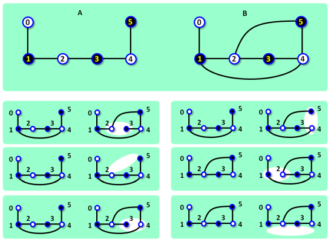

# Network Topology Fix

The topology of the two separate networks, A and B, in the campus was planned to be identical. Both networks consist of fast servers and regular servers and the connections between them. The number of servers, the number of fast servers and the number of connections is planned to be is the same in both networks. Moreover the topologies of both networks is to be identical. It means, that there is a one-to-one mapping between the servers in A and the servers in B. The mapping maps each fast server in one network to a fast server in the other network and also it maps each regular server in one network to a regular server in the other network. Furthermore, two servers x, and y in A are connected are connected if and only if there are other two connected servers, z and w, in network B, and the mapping maps x to z and y to w.
In determining the topology only connections are relevant, physical location of servers and connections are nor relevant.

Both networks were built gradually. First, all servers were delivered and activated and then, one after another, connections among particular servers were established.
However, when all connections in network B were completed and there was a last connection to be established in network A, a mistake happened. The delivering company made en error in coordinates of the last connection and instead of installing the connection in network A they installed it in network B. There, they made another mistake, and wrongly installed the connection between two, yet not connected, servers which were chosen in effect randomly. Consequently, now network B contains one more connection than it should contain and network A contains one less connection than it should contain.

The company is going to move the wrong connection from network B to network A, to fix the issue. The company analyst noticed an important feature which may simplify the fix. The costs of manipulating the connections at physically different locations in both networks may differ significantly. It may be cheaper to remove some other connection from network B than the improperly installed one and also it may cheaper to to install the last connection between other servers in network A than originally planned. If the topologies of both networks are identical after the fix, there is a chance the owners of the network may still consider the solution acceptable.



*Figure 1. The top part shows networks A and B before the fix. Fast servers are depicted as dark nodes. The bottom part depicts all possible ways to fix the networks. In each of them, one connection is removed from B and one is added to A. The (approximate) location of removed connection in network B is highlighted. The added connection in network A is {1, 4} in the first four cases, and {2, 5} in the last two cases (bottom right). Note that the shared networks topology resulting from the fix in those last two cases differs from the shared topology in the previous cases. The schemes corresponds to Example 1 below.*

## The task

You are given the topologies of both networks before the fix. Produce a list of all pairs of locations from where the wrong connection may be removed in network B and where it may be installed in network A, so that the resulting topologies of both networks are identical.

## Input

The first input line contains three integers N, C, F, where N is the number of servers in each network, C is the *planned* number of connections in each network, and F is the number of fast servers in each network. The servers in each network are labeled 0, 1, 2, ..., N−1. The next line contains F integers, separated by spaces, representing the labels of fast servers in network A. Next, there are C−1 lines, each line describes one existing connection between two servers in network A. The next line contains F integers, separated by spaces, representing the labels of fast servers in network B. Finally, there are C+1 lines, each line describes one existing connection between two servers in network B, in the same format as in network A.
The connections in both networks, and also each particular connection are given in arbitrary order.
It holds, 4 ≤ N ≤ 30, N−1 ≤ C ≤ 100, 0 ≤ F ≤ N.

## Output

The output contains one or more text lines. Each line contains four integers a, b, c, d, separated by space, which specify a connextion fix. The integers a, b (a < b) are the labels of two servers in network A, between which a final connection may be installed. The integers c, d (c < d) are the labels of two servers in network B, between which a connection may be removed. Both networks, after the change described on the output line, share identical topology.
The output lines list all possible changes and are sorted in ascending lexicographical order of quadruples (a, b, c, d).
There is always at least one output line. The number of output lines does not exceed 2000.

## Example 1
### Input
```
6 6 3
1 3 5
0 1
1 2
2 3
3 4
4 5
1 3 5
0 1
1 2
1 4
2 3
2 5
3 4
4 5
```
### Output
```
1 4 2 3
1 4 2 5
1 4 3 4
1 4 4 5
2 5 1 2
2 5 1 4
```

The data of Example 1 is depicted in Figure 1

## Example 2
### Input
```
7 7 1
1
0 1
1 2
1 5
2 3
3 4
3 6
4
0 1
0 4
1 2
1 3
2 3
4 5
4 6
5 6
```
### Output
```
0 5 2 3
4 6 5 6
```

## Example 3
### Input
```
5 6 2
0 3
0 1
0 4
1 2
2 3
3 4
1 4
0 4
0 3
0 1
0 2
1 2
2 3
3 4
```
### Output
```
1 4 0 2
1 4 0 3
2 4 0 2
2 4 0 3
```